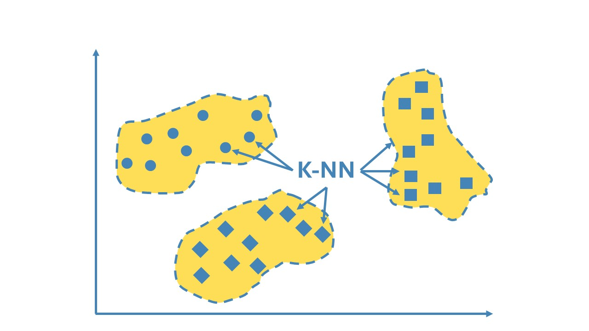
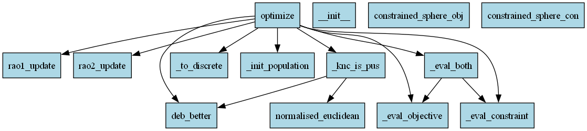
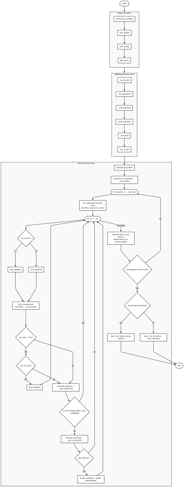

## k Nearest Neighbor algorithm for Rao Optimization



This Python code implements a k-nearest neighbor comparison (k-NNC) framework for discrete and continuous optimization. This algorithm reduces the computational cost of metaheuristic optimization by filtering out unpromising candidate solutions before evaluating their feasibility, a task which is generally computationally demanding since often a costly finite element analysis needs to be performed in order to find out if any constraints are violated (at least for structural optimization). Compared to traditional metaheuristic algorithms, in which the objective and constraint functions are used for evaluation of every generated candidate, the k-NNC method significantly reduces the number of structural analyses required while maintaining solution quality, improving overall computational efficiency.
Core implementation features:
* Two Rao algorithm variants (Rao-1 and Rao-2) used as parameter-free metaheuristic optimizers
* k-nearest neighbor comparison filter that identifies and discards possibly useless solutions (PUS) without evaluating them
* Deb's constraint-handling rules for robust management of feasibility in constrained optimization problems
* Separate objective and constraint function interfaces that reflect the cost asymmetry between cheap weight evaluation and expensive structural analysis
* Support for both continuous and discrete design variable spaces, with index-based rounding for discrete section selection

In reference [1] the Rao optimization algorithms are first introduced as metaphor-less, parameter-free metaheuristic methods for global optimization. Rao-1 and Rao-2, which are the two variants used in the present implementation, are defined by Equations 1 and 2 of reference [1] respectively. In reference [2] the k-NNC method is formally proposed and combined with the Rao algorithms for discrete truss sizing. The k-NNC filtering procedure is described in Section 3.2 and Algorithm 1 of reference [2], where the normalized Euclidean distance metric used to identify nearest neighbors is given by Equation 4. The extension of k-NNC using Deb's rules for constraint handling is presented in Section 4.2 and Algorithm 2 of the same reference ([2]), which also provides the discrete variable handling via the rounding technique of Equations 7–9. The constraint violation measure used in the present code follows Equation 6 of reference [2]. Deb's constraint-handling rules themselves are originally introduced in reference [3]. 

The code demonstrates how to reduce the number of expensive structural analyses in population-based optimization without sacrificing the quality of the optimal solution. Traditional metaheuristic algorithms treat objective evaluation and constraint evaluation as a single inseparable step, applying it to every candidate solution generated at every iteration. In structural engineering, however, constraint evaluation requires a full finite element analysis of the structure, which is orders of magnitude more expensive than simply computing the structural weight. The k-NNC mechanism exploits the fact that candidate solutions generated near inferior population members are themselves likely to be inferior, and discards them without performing the computationally expensive analysis. The accuracy of this judgment improves automatically as the population converges, since the nearest neighbors become increasingly reliable proxies for the local solution quality.

Key applications of the present algorithm include, but are not limited to the following:
* Discrete truss sizing - minimizing truss weight by selection of cross-section areas from standard catalogues for planar and spatial truss structures under stress and displacement constraints
* Continuous structural optimization - weight minimization of frames and mechanical components subject to nonlinear stress and buckling constraints
* Shape and topology optimization - extension to combined sizing and shape problems where finite element analysis is particularly expensive
* Reliability design - optimization of components under multiple load cases with correlated failure modes
* General expensive black-box optimization - any domain where objective function evaluation is cheap but feasibility checking requires a costly external solver
* Implementation with metaheuristics other than Rao algorithms, e.g. genetic algorithms, particle swarm algorithms, etc.

This code reveals how the k-NNC filter interacts differently with the two Rao variants. Rao-2 generates more diverse candidates due to its additional random interaction term, which means a higher fraction of its candidates are filtered out by k-NNC, resulting in greater savings in constraint evaluations. Rao-1, on the other hand, produces more conservative updates that are already closer to the current best, so its k-NNC skip rate is somewhat lower but its solution quality tends to be more consistent. In the constrained continuous test case, both variants find feasible solutions near the analytically expected optimum, with the nonlinear trigonometric constraint g3 active at the solution, demonstrating that the algorithm correctly identifies and respects active nonlinear boundaries.

This framework's flexibility allows extension to more complex structural systems with additional design variables, multiple load cases and different constraint types, making it a versatile tool for computationally expensive engineering optimization wherever the bottleneck lies in repeated structural analysis rather than in the search strategy itself.

## Prerequisites

* The following Python packages are required:

1. numpy

* The following Python modules are required:

1. typing

## Quick Start

* Clone or download the repository
* Open the project directory in VS Code or other Integrated Development Environment (IDE)
* Run the main script (main.py)

## Dependency graph



## Algorithm diagram



## Algorithm Flowchart

``` 
Start
  ↓
Define Helper Functions
  ├── normalised_euclidean(x_new, x_pop, lower, upper): Normalised Euclidean distance (Eq. 4)
        ├── range_ = upper - lower  (replace 0s with 1.0 to avoid division by zero)
        ├── diff = (x_new - x_pop) / range_
        └── return sqrt(sum(diff^2, axis=1))
  ├── rao1_update(x_p, x_best, x_worst, rng): Rao-1 candidate generation (Eq. 2 / Eq. 8)
        ├── r1 ~ Uniform(0,1)^n_vars
        └── return x_p + r1 * (x_best - x_worst)
  ├── rao2_update(x_p, x_best, x_worst, x_r, rng): Rao-2 candidate generation (Eq. 3 / Eq. 9)
        ├── r1, r2 ~ Uniform(0,1)^n_vars
        ├── swap ~ Bernoulli(0.5)^n_vars
        ├── if swap:  term2 = |x_p| - |x_r|  else:  |x_r| - |x_p|
        └── return x_p + r1*(x_best - x_worst) + r2*term2
  └── deb_better(w_a, c_a, w_b, c_b): Deb's constraint-handling comparison (Section 4.2)
        ├── if c_a=0 and c_b>0: A is better (feasible beats infeasible)
        ├── if c_a>0 and c_b=0: B is better
        ├── if c_a=0 and c_b=0 and w_a < w_b: A is better 
        └── if (c_a>0 and c_b>0 and c_a < c_b) or if (c_a=c_b and w_a < w_b): A is better
  ↓
Define KNNCRaoOptimizer Class
  ├── Attributes:
      ├── obj_fn: objective function
      ├── constraint_fn: constraint violation function C(x) (Eq. 6); C(x)=0 means feasible
      ├── n_vars: number of design variables
      ├── lower, upper: lower and upper bounds of design variables
      ├── discrete_sets: list of sorted arrays per variable (None for continuous)
      ├── use_knnc: enable/disable k-NNC mechanism
      ├── NP: population size
      ├── k: number of nearest neighbours for k-NNC
      ├── max_iter: maximum number of iterations
      ├── rao_variant: 1 (Rao-1) or 2 (Rao-2)
      ├── tol: convergence tolerance on relative objective value spread
      ├── seed: random seed
      ├── n_obj_evals: counter for objective function evaluations (NFEs)
      ├── n_con_evals: counter for constraint function evaluations (NCFs)
      └── n_skipped: counter for candidates skipped by k-NNC
  └── Core Methods:
      ├── _to_discrete(x): Map continuous value to nearest discrete option
          ├── if discrete_sets is None: return x
          └── else: for each variable i, find nearest value in discrete_sets[i]
      ├── _init_population(): Initialise population using index-based rounding (Eq. 7)
          └── for p = 1 to NP:
              ├── r ~ Uniform(0,1)^n_vars
              ├── if discrete: x_p[i] = discrete_sets[i][ round(r[i] * (ns-1)) ]
              └── else: x_p = lower + r * (upper - lower)
      ├── _eval_objective(x): Evaluate objective
          ├── n_obj_evals=n_obj_evals+1
          └── return obj_fn(x)
      ├── _eval_constraint(x): Evaluate constraint violation
          ├── if constraint_fn is None: return 0.0
          ├── n_con_evals=n_con_evals+1
          └── return constraint_fn(x)
      ├── _eval_both(x): Evaluate objective and constraint together (used at initialisation)
          ├── w = _eval_objective(x)
          ├── c = _eval_constraint(x)
          └── return w, c
      ├── _knc_is_pus(x_new, current_idx, population, objVals, violations): k-NNC check (Sec. 3.2)
          ├── normalised_euclidean(x_new, population, lower, upper)
          ├── Set distances[current_idx] = inf  (exclude self)
          ├── nn_indices = ids of the first k lowest distances (k nearest neighbours)
          ├── for each idx in nn_indices:
              └── if deb_better(w[idx], c[idx], w[current], c[current]) (if neighbor better than x_current)
                  └── n_better=n_better+1
          └── return True (PUS) if n_better < (k - n_better) (if majority not better)
      └── optimize(): Main optimisation loop (Algorithm 2)
  ↓
Main Execution Flow
  ├── population = _init_population()
  ├── for p = 1 to NP:
      └── objVals[p], violations[p] = _eval_both(population[p])
  ├── for iteration = 1 to max_iter:
      ├── Sort population by Deb's rules (feasible first, then by objective value)
      ├── x_best = individual at order[0] (best)
      ├── x_worst = individual at order[-1] (worst)
      ├── for p = 1 to NP:
          ├── Generate candidate x_new:
                ├── if rao_variant = 1:
                    └── x_new_cont = rao1_update(x_p, x_best, x_worst, rng) [Eq. 2 or 8]
                └── if rao_variant = 2:
                    ├── Select random x_r (r ≠ p)
                    └── x_new_cont = rao2_update(x_p, x_best, x_worst, x_r, rng)  [Eq. 3 or 9]
          ├── Clip x_new_cont to [lower, upper]
          ├── x_new = _to_discrete(x_new_cont)   (rounding step if applicable, Eqs. 8–9)
          ├── if use_knnc=True:
              └── if _knc_is_pus(x_new, p, population, objVals, violations):
                  └── n_skipped = n_skipped + 1 (skip, do not evaluate and continue to next p)
          ├── w_new = _eval_objective(x_new)
          ├── if violations[p]=0 and w_new > objVals[p]:
              └── Skip constraint evaluation  (continue to next p)
          ├── c_new = _eval_constraint(x_new)
          └── if deb_better(w_new, c_new, objVals[p], violations[p]):
                population[p] = x_new
                objVals[p] = w_new
                violations[p] = c_new
      ├── best_w = min objective value among feasible individuals (violations=0)
      ├── mean_w = mean(objVals)
      ├── history_objVal.append(best_w)
      └── if |mean_w / best_w - 1| < tol
          └── break (convergence)
  ├── if any feasible individual exists:
      └── best = min objective value among feasible
  └── else:
        best = min violations (least infeasible)
  ↓
Return Results
  ├── best_x:         best solution found
  ├── best_objVal:    objective value of best solution
  ├── best_violation: constraint violation of best solution
  ├── n_obj_evals:    total objective evaluations (NFEs)
  ├── n_con_evals:    total constraint violation evaluations (NCFs)
  ├── skip_rate:      fraction of candidates skipped by k-NNC
  └── history_objVal: best objective value per iteration
  ↓
End
```

## Results

```
============================================================
Constrained continuous optimization demo
  min  f(x) = sum(x_i^2),  x in [-4,4]^5
  s.t. g1: sum(x_i) >= 3
       g2: x1^2 + x2^2 <= 9
       g3: sin(x1) + cos(x2) <= 1.2   (nonlinear)
============================================================

Method                  Best f(x)    Violation     NFEs     NCFs    Skip%
-------------------------------------------------------------------------
Rao1-kNNC(k=3)           1.834000     0.000000     7996     4132    46.9% 
Rao1-kNNC(k=5)           1.836779     0.000000     9099     4274    39.5% 
Rao1 (no kNNC)           1.834205     0.000000    15030     6575     0.0% 
Rao2-kNNC(k=3)           1.840026     0.000000     8116     3924    46.1% 
Rao2-kNNC(k=5)           1.838288     0.000000     8390     3806    44.3% 
Rao2 (no kNNC)           1.842672     0.000000    15030     5769     0.0% 

Best solution detail [Rao1-kNNC(k=3)]:
  x*          = [0.455676 0.707721 0.612556 0.613689 0.61127 ]
  f(x*)       = 1.834000
  sum(x*)     = 3.000913  (must be >= 3.0)
  x1^2+x2^2   = 0.708510  (must be <= 9.0)
  sin+cos     = 1.199915  (must be <= 1.2)
  Feasible?   = True

Best solution detail [Rao1-kNNC(k=5)]:
  x*          = [0.440799 0.69286  0.632984 0.624989 0.609211]
  f(x*)       = 1.836779
  sum(x*)     = 3.000844  (must be >= 3.0)
  x1^2+x2^2   = 0.674359  (must be <= 9.0)
  sin+cos     = 1.196085  (must be <= 1.2)
  Feasible?   = True

Best solution detail [Rao1 (no kNNC)]:
  x*          = [0.463715 0.723    0.615471 0.59366  0.604323]
  f(x*)       = 1.834205
  sum(x*)     = 3.000170  (must be >= 3.0)
  x1^2+x2^2   = 0.737761  (must be <= 9.0)
  sin+cos     = 1.197097  (must be <= 1.2)
  Feasible?   = True

Best solution detail [Rao2-kNNC(k=3)]:
  x*          = [0.479479 0.747294 0.565667 0.610825 0.598824]
  f(x*)       = 1.840026
  sum(x*)     = 3.002089  (must be >= 3.0)
  x1^2+x2^2   = 0.788349  (must be <= 9.0)
  sin+cos     = 1.194847  (must be <= 1.2)
  Feasible?   = True

Best solution detail [Rao2-kNNC(k=5)]:
  x*          = [0.459038 0.71493  0.623098 0.57654  0.629124]
  f(x*)       = 1.838288
  sum(x*)     = 3.002731  (must be >= 3.0)
  x1^2+x2^2   = 0.721841  (must be <= 9.0)
  sin+cos     = 1.198225  (must be <= 1.2)
  Feasible?   = True

Best solution detail [Rao2 (no kNNC)]:
  x*          = [0.485467 0.767061 0.585953 0.568096 0.593748]
  f(x*)       = 1.842672
  sum(x*)     = 3.000325  (must be >= 3.0)
  x1^2+x2^2   = 0.824061  (must be <= 9.0)
  sin+cos     = 1.186575  (must be <= 1.2)
  Feasible?   = True
```

## License
See LICENSE.

## Contributing
We welcome contributions! Please see CONTRIBUTING for guidelines. Check how D-vine copula algorithm is applied for seismic reliability analysis in reference [4] for example.

## Support
For questions, issues, or feature requests contact me directly through email at gpapazafeiropoulos@yahoo.gr

## References

1. **Rao algorithms**

Rao, R. V. (2020). Rao algorithms: Three metaphor-less simple algorithms for solving optimization problems. International Journal of Industrial Engineering Computations, 11(1), 107-130.

2. **k Nearest Neighbor Comparison algorithm for structural optimization**

Pham, H. A., Dang, V. H., Vu, T. C., & Nguyen, B. D. (2024). An efficient k-NN-based rao optimization method for optimal discrete sizing of truss structures. Applied Soft Computing, 154, 111373.

3. **Deb's constraint-handling rules**

Deb, K. (2000). An efficient constraint handling method for genetic algorithms. Computer methods in applied mechanics and engineering, 186(2-4), 311-338.